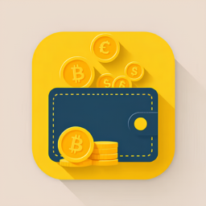

# CoinExchange

CoinExchange é um aplicativo Android desenvolvido em Kotlin e Jetpack Compose, que permite a consulta de corretoras de
criptomoedas utilizando a API da CoinAPI.io.

## ✨ **Features**

- **Listagem de Corretoras**: Apresenta uma lista das corretores com informações relevantes, como nome, ID e volume de
  negociação nas últimas 24h.
- **Detalhes da Corretora**: Ao selecionar uma corretora, é possível visualizar detalhes adicionais sobre ela.

## 🎥 **Demonstração**


## 🛠 Tecnologias Utilizadas

- **Linguagem**: 
- **UI Framework**: 
- **Injeção de Dependência**: 
- **Networking**: 
- **Testes**:  
- **Arquitetura**: MVVM + Clean Architecture

## 🚀 **Como Executar o Projeto**

### Passos

1. **Clonar o repositório**
    ```bash
    git clone https://github.com/cggcaio/CoinExchange.git
    ```

2. **Abrir no Android Studio**
   - Abra o projeto na IDE e aguarde a sincronização das dependências.

3. **Configurar API Key**
   - Crie um arquivo `local.properties` na raiz do projeto.
   - Adicione sua chave da CoinAPI.io:
    ```properties
    COIN_API_KEY="sua_api_key_aqui"
    BASE_URL="rest.coinapi.io"
    ```
   - _Caso não tenha uma chave, acesse a [CoinAPI.io](https://docs.coinapi.io/?shell#list-all-exchanges-get) e crie uma conta._

4. **Rodar o aplicativo**
   - Após o Sync, execute um emulador ou conecte um dispositivo físico.
   - Execute o projeto pressionando no botão de "Run".

## 📌 **Estrutura do Projeto**

```
coinexchange/
│-- app/
|   |--core/               # Core do projeto (bases, components, utils, widgets...)
│   │-- exchange/          # Módulo de Corretoras 
│   │   │-- constants/     # Constantes
│   │   │-- data/          # Mappers, models, service
│   │   │-- di/            # Injeção de dependência do módulo
│   │   │-- domain/        # Models, repositories, usecases
│   │   │-- navigation/    # Navegação
│   │   │-- presentation/  # UI, viewmodels, previews
│   │-- network/           # Retrofit
│   │-- ui/                # Telas do aplicativo (Compose)
│   |   │-- theme/         # Temas e estilos visuais customizados
│-- build.gradle.kts       # Configuração do projeto
```

🎨 **Ícone do App**



Desenvolvido com ❤️ por **Caio Gonçalves** 🤠.
